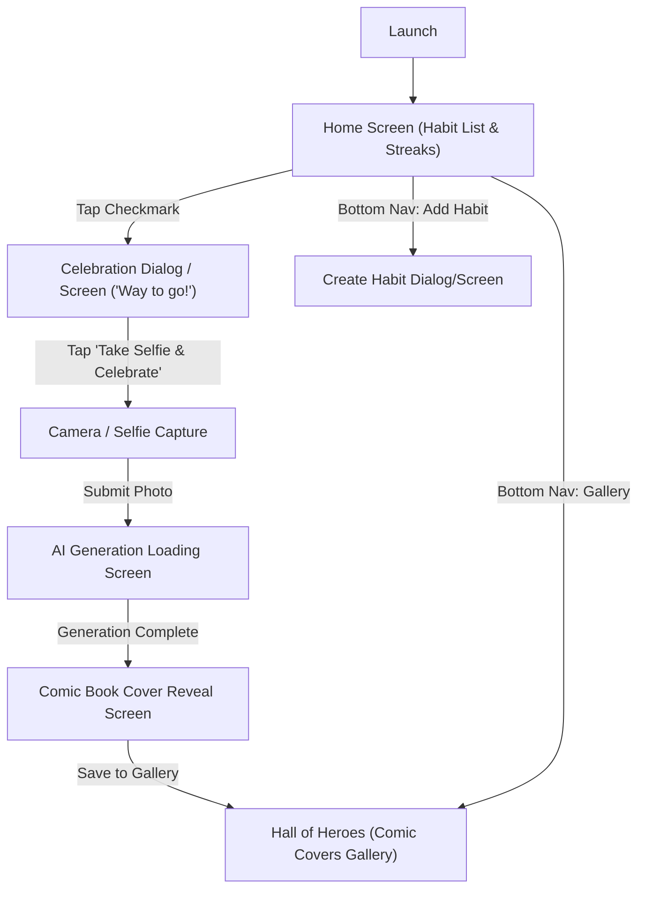

# User Flow — HeroHabit

## Screen Map & Navigation Hierarchy

## User Journeys
1. **Daily Check-in Flow**:
   - User opens app $\rightarrow$ marks "Morning Jog" complete $\rightarrow$ Streak increments from 6 to 7.
   - Prompt: "Way to go! Take a selfie to mint your Day 7 Comic Cover."
   - User snaps photo $\rightarrow$ Replicate API returns comic cover $\rightarrow$ Cover displayed with share button.
2. **Hall of Heroes Review Flow**:
   - User navigates to Gallery $\rightarrow$ views grid of historical comic book covers with streak milestones.
